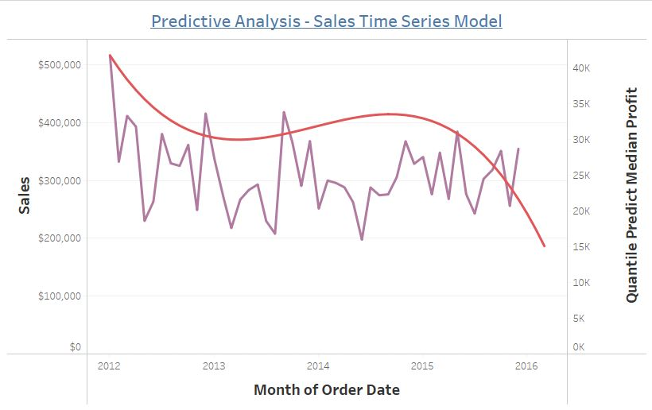
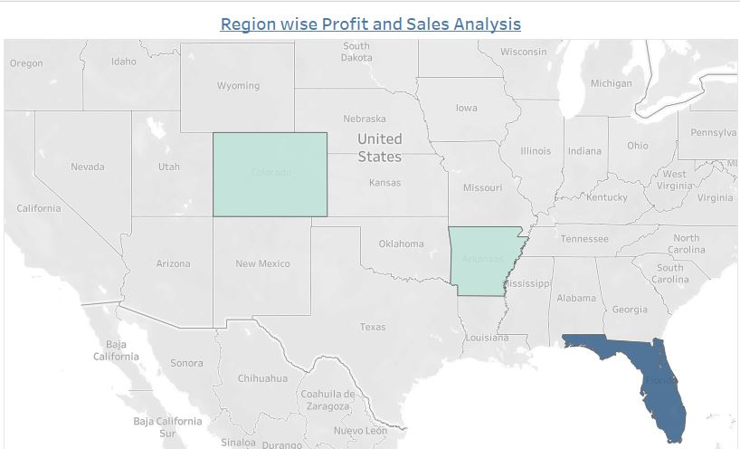
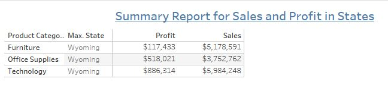
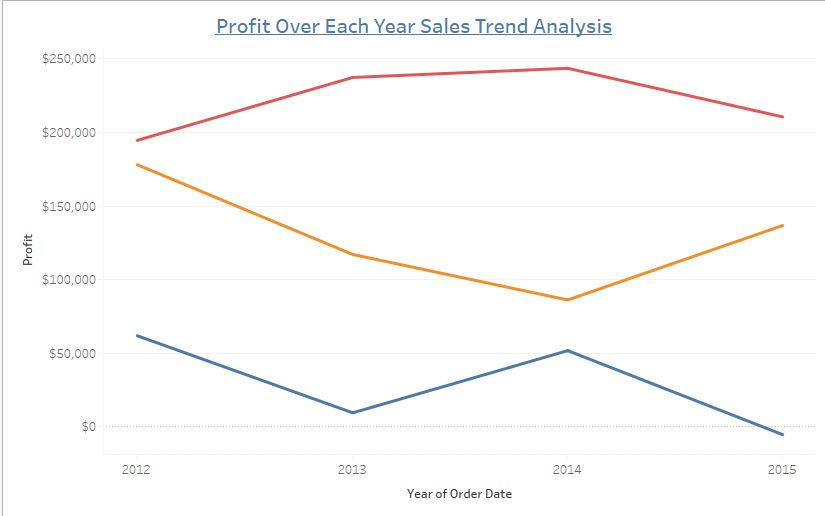
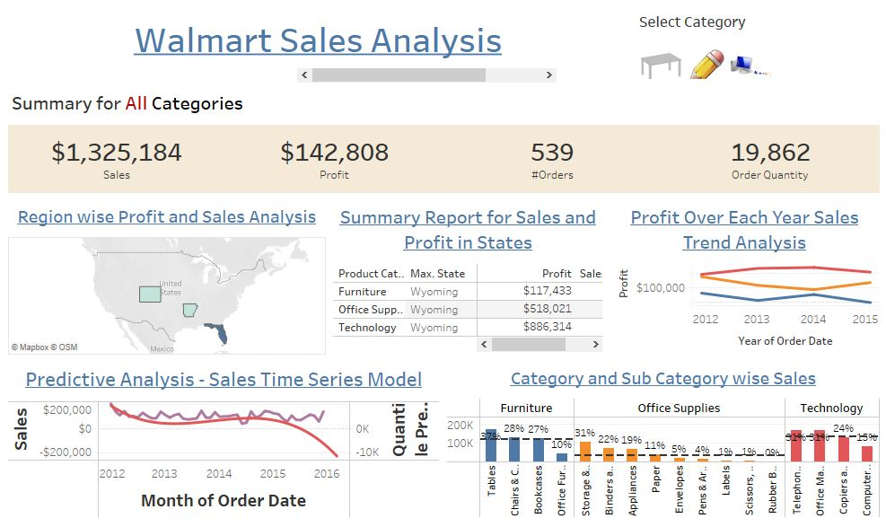

# E-Commerce-Sales-Analytics

## Project Overview
E-commerce is the activity of electronically buying or selling of products on online services or over the Internet. The COVID-19 global e-commerce surge was initially born out of necessity. Online shopping provided a practical alternative as retail locations closed and people stayed in to avoid the virus. Hence, in this project we tried to show the trend in E-Commerce in terms of sales, profit and predict the growth of the companies over the years.

## Tool Used
Tableau

## Tableau Workbook
Walmart_Sales_Dashboard.twbx

## Dataset Used
Walmart Retail Data.csv

This visualization's data source, Kaggle open source, was used to obtain the information for our 
Tableau visualization. The following fields in the excel spreadsheet were utilized to build 
different interactive visualizations.
1.Product Category: The dataset has three significant categories. Technology, furniture, and 
office supplies.
2.Product subcategory: Each major product category includes several subcategories, for 
example, furniture has subcategories for tables, chairs, chair mats, bookcases, and office 
furniture. Similar to how each product category has its own respective subcategories.
3.Region: An examination of the United States' central, eastern, western, and southern 
regions.
4.State: Data on sales and profits for the entire state, broken down by product type and 
subcategory.
5.Sales: The total quantity of purchases made by Walmart in a given year and category.
6.Profit: In a given year, profit was made in each category.
7.Order Date: Order date in the following format of DD-MM-YYYY
8.Order Priority: It represents various order importance values, including "high," "low," 
"medium," and "critical."
9.Product Container: It shows a variety of container sizes, such as jumbo drums, wrap bags, 
small packs, medium boxes, large boxes, and jumbo boxes.
10.Shipping mode: Three delivery options are available to analyze the data: express air, 
regular air, and delivery truck.

The dataset can be loaded into tableau public by directly importing the data file as a “data
source” by navigating to the Data -> New Data Source option.

## Implementation
We have implemented following given analysis on our dashboard:

1. Predictive Analysis - Sales Time Series Model
 
 

2. Region Wise Profit and Sales Analysis

 

3. Summary report for Sales and Profit in states

 

4.Profit over each year sales trend analysis

 

## Summary of the Dashboard

 
